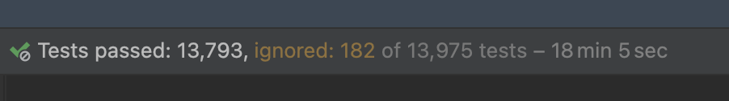

= 介绍

*Kotlite* 是一个开源的类型安全编程语言，它拥有 https://kotlinlang.org/[Kotlin] 编程语言 https://kotlinlang.org/docs/custom-script-deps-tutorial.html[脚本] 变体的丰富子集。它附带了标准库，这些库是 Kotlin Multiplatform/Common 标准库和一些第三方库的子集。

*Kotlite 解释器* 是一个轻量级的 Kotlin Multiplatform 库，用于解释和执行用 Kotlite 编写的代码，并在主机运行时环境和嵌入式运行时环境之间建立桥梁。

https://github.com/sunny-chung/kotlite/[icon:github[] Kotlite GitHub 仓库]

== Kotlite 解释器的主要特性

* 支持 Kotlin 1.9 语言和标准库的一个子集。https://kotlinlang.org/[Kotlin] 是一个出色、安全、描述性强且灵活的语言。请查看 <<_language, Kotlite 与 Kotlin 之间的区别>>。
* 支持编写复杂的泛型代码
* 可嵌入 -- 它是一个库
* 安全
** 可以白名单或黑名单库或内置中的类
** 可以白名单或黑名单库或内置中的扩展函数
** 可以白名单或黑名单库或内置中的扩展属性
** 可以白名单或黑名单库或内置中的全局属性
** 标准库中没有文件或网络 I/O 或操作系统 API
* 多平台运行
* 可扩展并允许与主机交互
** 允许从主机提供自定义扩展函数
** 允许从主机提供自定义扩展属性
** 允许从主机提供自定义全局属性
** 允许实现自定义库并将调用委托给一等 Kotlin 函数和属性
** 允许从主机读取嵌入式环境中全局变量的值
** 嵌入式环境的标准输出管道是可覆盖的
* 轻量级 -- `kotlinc` 超过 300 MB，而 Kotlite 加上所有平台标准库的总和小于 10 MB。Web 演示的 JS 脚本小于 800 KB。
* 执行前进行语义分析，例如变量访问和类型验证
* 类型推断
* 经过良好测试 -- 每个平台有超过一千个手工编写的单元测试
* 可以在任何支持 Kotlin 1.9 的 IDE 中编写 -- Kotlite 不会创建新语法

CAUTION: 说实话，标准库没有经过良好测试。只有语言本身经过了良好测试。如果发现任何问题，请帮忙报告。

== 支持的平台

- JVM (Java, Kotlin/JVM, …)
- JS
- Android (JVM)
- iOS
- macOS
- watchOS
- tvOS

除了内置组件外，解释器不依赖任何特定平台的 API，因此对于有经验的开发者来说，将这个库移植到 Kotlin Multiplatform 支持的任何其他平台应该很容易。

== 使用场景

Kotlite 是为以下使用场景设计的。

* 以安全方式执行用户提供的简单表达式
* 以安全方式执行用户提供的脚本
* 允许用 Kotlin 代码编写的自定义插件，以安全方式用于任何 Kotlin 或 JVM 应用程序
* 安全地执行来自服务器的代码
* 随时更新移动应用 UI，而无需向应用商店提交应用更新（这需要社区贡献）

== 非目标

* Kotlite 不会取代 Kotlin
* Kotlite 不会引入 Kotlin 中未提供的新编程语言特性或语法，除了支持 Kotlite 内部工具所需的内容

== 副产品

* 使用 https://github.com/mermaid-js/mermaid[mermaid] 将 Kotlite 代码渲染为 AST（抽象语法树）图表
* Kotlite 代码的静态分析
* 从 Kotlite 代码生成 AST 节点
* 重新格式化 Kotlite 代码
